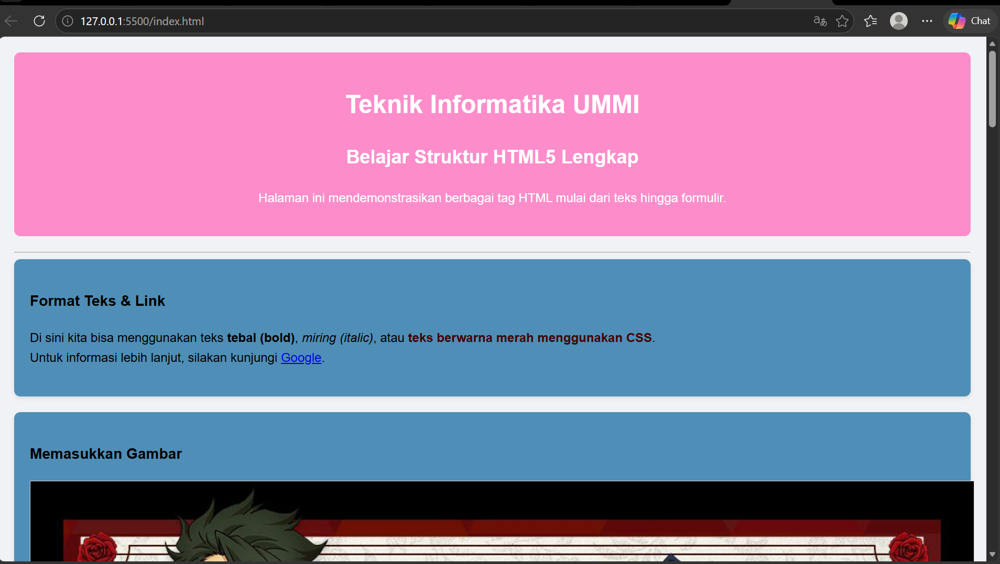
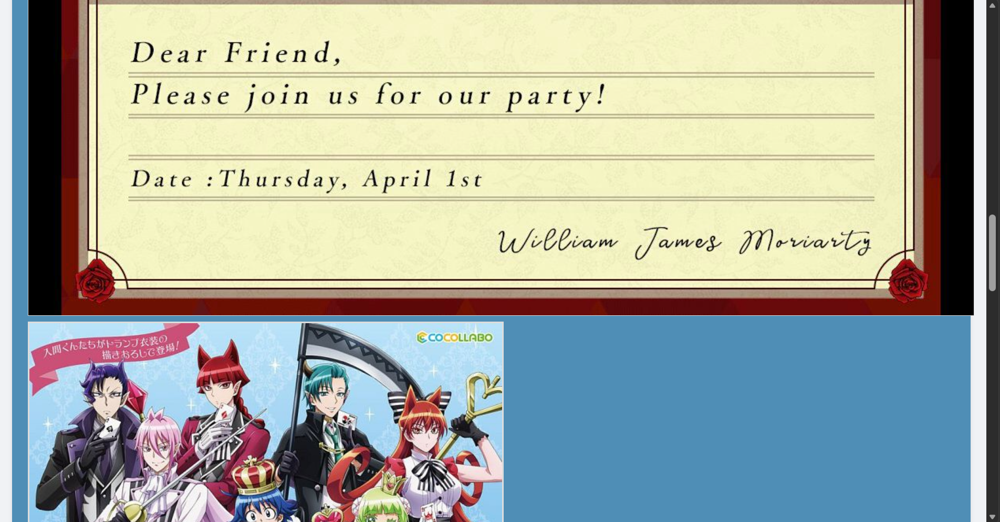
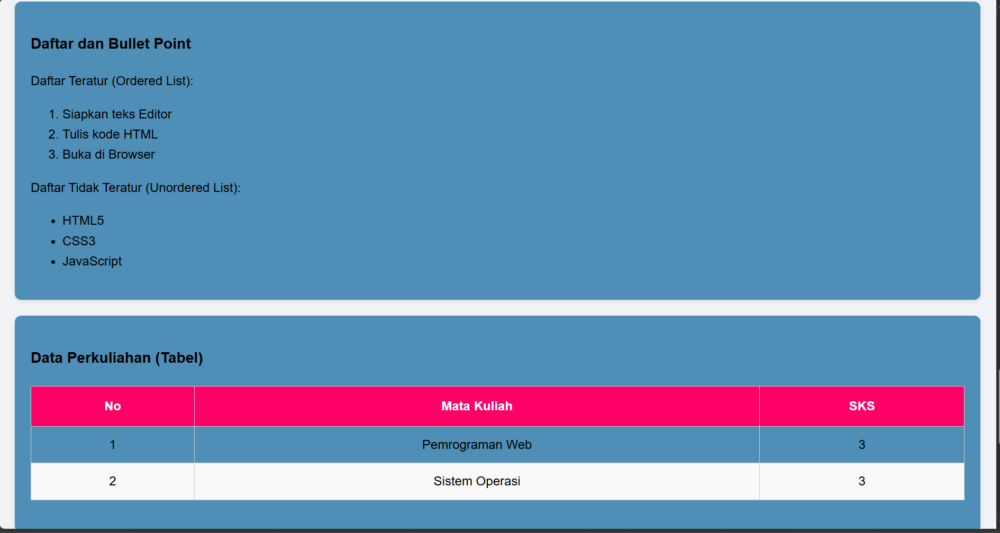
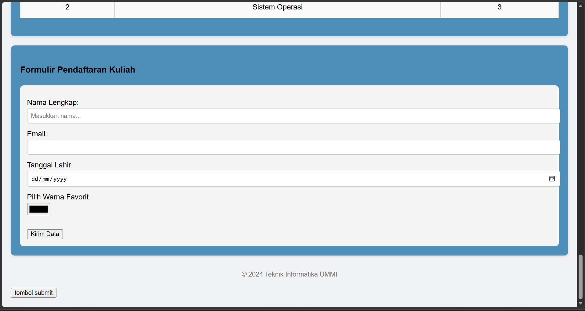

# 🎓 Web Profil & Pendaftaran - Teknik Informatika UMMI

Proyek ini adalah implementasi praktis dari mata kuliah Pemrograman Web yang mendemonstrasikan penggunaan struktur HTML5, desain modern menggunakan CSS3, serta logika interaktif menggunakan **JavaScript (ES6)**.

## 🚀 Fitur Utama
- Struktur Semantik HTML5: Menggunakan elemen header, section, table, dan footer secara tepat.
- Desain Aesthetic: UI modern dengan palet warna slate-blue, tipografi dari Google Fonts (Poppins & Inter), serta efek hover transisi.
- Formulir Interaktif: Validasi input sederhana dan pengolahan data menggunakan JavaScript.
- Responsive Layout: Tampilan yang bersih dan proporsional di berbagai ukuran layar.
- DOM Manipulation: Mengubah konten halaman secara dinamis tanpa reload.

## 🛠️ Teknologi yang Digunakan
- HTML5: Sebagai kerangka dasar aplikasi.
- CSS3: Digunakan untuk styling aesthetic, termasuk penggunaan Flexbox, Box Shadows, dan Google Fonts.
- JavaScript: Menangani logika interaksi, event handling, dan manipulasi DOM.

## 📂 Struktur Folder
```text
.
├── index.html     # Halaman utama (struktur)
├── style.css      # File styling (tampilan aesthetic)
├── script.js     # Logika interaktif (interaksi & logika)
└── MTP.jpg        # Aset gambar (profil/gambar pendukung)
```

## 📝 Materi JavaScript yang Diimplementasikan
Dalam proyek ini, JavaScript digunakan untuk mendemonstrasikan konsep-konsep berikut:
1. Inline & External JS: Penggunaan `onclick` pada tombol dan penghubungan file `.js` eksternal.
2. Variabel & Tipe Data: Menggunakan `const` dan `let` untuk menyimpan referensi elemen DOM.
3. Fungsi (Arrow Function): Membuat fungsi sapaan yang ringkas.
4. Logika Percabangan (If...Else): Validasi formulir untuk memastikan input tidak kosong.
5. Perulangan (Looping): Menghitung jumlah baris data pada tabel perkuliahan melalui console.
6. DOM Manipulation: Mengambil elemen menggunakan `querySelector` dan mengubah konten dengan `.innerHTML`.

## ⚙️ Cara Menjalankan
1. Clone repositori ini:
   ```bash
   git clone [https://github.com/meisyaaaa/daftar-list-anime-mey](https://github.com/username-anda/nama-repo.git)
   ```
2. Pastikan file `index.html`, `style.css`, dan `script.js` berada dalam folder yang sama.
3. Buka file `index.html` menggunakan browser favorit Anda.

## 📸 Tampilan Pratinjau





---
Dibuat oleh: [Meisya Amelia Putri]  
Prodi: Teknik Informatika - Universitas Muhammadiyah Sukabumi (UMMI)
```

### Tips untuk GitHub:
1. Selalu sabar yaa!!!
2, Selalu sabar aja,,,,
3. Orang sabar di sayang tuhan,,,